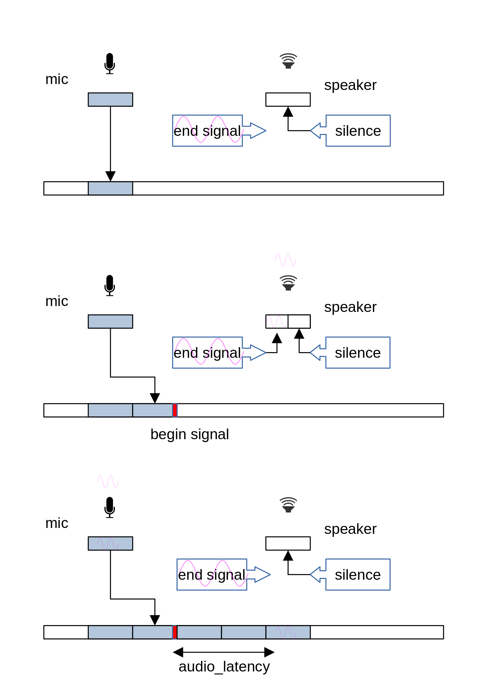
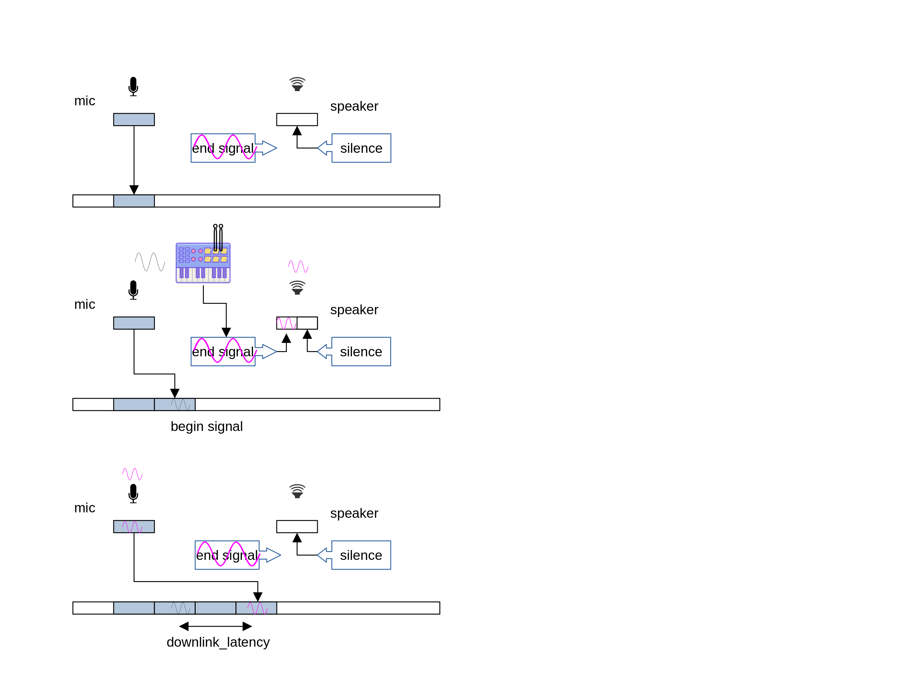

# audiolat
A tool to measure audio latency (ear-to-mouth delay) in android systems.


# 1. Introduction

This app calculates the "audio latency" of an android device (also known as DUT or "device under test") by performing 2 different experiments:

* (1) full (aka e2m aka ear-to-mouth aka audio latency): In a full (e2m) experiment, we play a sound in the audio output (e.g. a speaker), and then look for it in the audio input (e.g. a mic). We measure the latency between the moment we played out the sound, and the moment we recorded it, and call it "full audio latency". Note that this measures the latency of both the downlink (speaker) and the uplink (mic) of the DUT.

* (2) downlink (aka midi): In a downlink experiment, we connect a midi device (a drum pad) to the DUT. Then, we play a sound in DUT audio output (e.g. a speaker) when the user hits the pad. We capture both sounds from the mic input. We measure the latency between the moment we heard the original pad hitting, and the reponse audio file, and call it "downlink audio latency". Note that this measures the latency of only the downlink (speaker) of the DUT.


# 2. Discussion: Full Audio Latency Measurement

The exact operation of the full (e2m) experiment is as follows.

* (1) we open 2 audio streams, one that records audio from the mic (uplink/input direction), and one that plays audio into the speaker (downlink/output direction). Each of the audio streams requires a callback function, which will be called every time the mic has new data ("record" stream), and every time the speaker needs new data ("playout" stream). The callback function includes as parameters:
  * (1.1) the data being captured, with its length (in number of frames) for the record stream
  * (1.2) an empty buffer for the app to provide the data being requested, with the required length (in number of frames), for the playout stream.

We also open a file stream where we store audio samples.

* (2) in the common operation, whenever we get a record stream callback, we just copy the data (the mic input) to the file stream. Whenever we get a playout stream callback, we provide silence into the output data (the speaker output).

* (3) we run a periodic latency experiment (every 2 seconds more or less). The experiment is started by a record stream callback. Instead of copying the full input, we replace the last few samples with that of a (short) well-known signal called "begin". This is effectively marking in the output file the moment where we started calculating an audio latency sample. Once we have inserted the full "begin" signal, we set a static variable in the callback to `true`.

When we get the next playout callback, we detect that we are in the middle of an audio latency experiment. In this case, we replace the silence with a second well-known signal called "end". This causes the "end" signal to be played at the speaker. At some point it gets captured back by the mic, and dumped into the file stream (see bullet (2)).

* (4) once the experiment is finished, we analyze the file stream, looking for poccurrences of both the begin and the end signals. We assume that the begin signal was injected with zero latency (as we are copying it directly to the output stream), but that the end signal went through the speaker, then the mic, and then the file. We assume the e2m latency of the system to be `timestamp_end - timestamp_begin`.



Figure 1 shows the exact experiment operation.

* The top image shows the common operation: Data from the record (uplink) callback is just copied to the output file (we use light blue to mean just background noise). Calls from the playout (downlink) callback are just filled with silence (white box).

* The middle image shows the beginning of an experiment. It starts with a record (uplink) callback, where the app replaces the last tidbit of the incoming signal with a begin signal (red box). In the next playout callback, the app will start playing the end signal instead of silence (pink sin).

* The bottom image shows the moment where the mic captures the signal it just played. This is common operation again, but in this case the mic signal we are copying into the file stream contains the end signal.

In the post-experiment analysis, we look for pairs of begin and end signals in the file stream, and calculate the `audio_latency` as the distance between both.


# 3. Discussion: Downlink-Only Audio Latency Measurement

The exact operation of the downlink (midi) experiment is as follows.

Unlike the previous experiment, this one requires an external midi device. We have used an [Alesis SamplePad 4](https://www.alesis.com/products/view2/samplepad-4) and a drum stick.

* (1) we open 2 audio streams, one that records audio from the mic (uplink/input direction), and one that plays audio into the speaker (downlink/output direction). Each of the audio streams requires a callback function, which will be called every time the mic has new data ("record" stream), and every time the speaker needs new data ("playout" stream). The callback function includes as parameters:
  * (1.1) the data being captured, with its length (in number of frames) for the record stream
  * (1.2) an empty buffer for the app to provide the data being requested, with the required length (in number of frames), for the playout stream.

We also open a file stream where we store audio samples.

* (2) in the common operation, whenever we get a record stream callback, we just copy the data (the mic input) to the file stream. Whenever we get a playout stream callback, we provide silence into the output data (the speaker output).

* (3) when the use hits the drum pad with the drum stick, it generates an actual sound itself. We call this the "begin" signal. The midi event iself is detected in a playout callback. We use it to replace the silence with a well-known signal (the "end" signal). This causes the "end" signal to be played at the speaker.

* (4) once the experiment is finished, we analyze the file stream, looking for poccurrences of both the begin and the end signals.

Note that:
  * (4.1.) We assume that the begin signal in the air (the actual hitting of the pad) and the injection of the end signal in the speaker happen at the same time. In other words, that the latency of the midi device is 0, at least when compared to uplink and downlink latencies.
  * (4.2.) Both the begin and the end signal pass through the DUT mic before being captured. While the mic latency is significative, we assume that it is the same latency for both signals, so we can ignore it.

We assume the downlink-only latency of the system to be `timestamp_end - timestamp_begin`.



Figure 2 shows the exact experiment operation.

* The top image shows the common operation: Data from the record (uplink) callback is just copied to the output file (we use light blue to mean just background noise). Calls from the playout (downlink) callback are just filled with silence (white box).

* The middle image shows the beginning of an experiment. It starts with the user hitting a drum pad with a drumstick. This causes the app to start playing the end signal instead of silence (pink sin) in the next playout callback. We can also see how the actual hitting of the pad gets captured by the mic, and written into the output stream (black sin)

* The bottom image shows the moment where the mic captures the signal it just played. This is common operation again, but in this case the mic signal we are copying into the file stream contains the end signal.

In the post-experiment analysis, we look for pairs of begin and end signals in the file stream, and calculate the `downlink_latency` as the distance between both.


# 4. Implementation Details

We provide implementations of both the full and downlink-only experiments using the 3 most common Android Audio API, namely
[aaudio](https://developer.android.com/ndk/guides/audio/aaudioaaudio.html),
javaaudio ([AudioRecord](https://developer.android.com/reference/android/media/AudioRecord.html) and
[AudioTrack](https://developer.android.com/reference/android/media/AudioTrack.html)), and
[oboe](https://github.com/google/oboe).
We do not provide an implementation using
[OpenSLES](https://www.khronos.org/opensles/).


We find that the 3 Audio APIs work better in android 10 and later devices.


# 5. Operation

## 5.1. Prerequisites

* android sdk setup and environment variables set
* android ndk
* adb connection to the device being tested.
* ffmpeg with decoding support for the codecs to be tested
* [soundfile](https://pypi.org/project/SoundFile/) package for parsing the output files.


## 5.2. Operation: Install

(1.a) Install the debug build apk located at:

```
$ adb install ./app/build/outputs/apk/debug/app-debug.apk
```

Note that you can uninstall the app at any moment by running:

```
$ adb uninstall com.facebook.audiolat
```


(1.b) As an alternative, build and install your own apk.

First set up the android SDK and NDK in the `local.properties` file. Create
a `local.properties` file with valid entries for the `ndk.dir` and `sdk.dir`
variables.

```
$ cat local.properties
ndk.dir: /opt/android_ndk/android-ndk-r19/
sdk.dir: /opt/android_sdk/
```

Note that this file should not be added to the repo.

Second build the encapp app:

```
$ ./gradlew clean
$ ./gradlew build
$ ./gradlew installDebug
```

(2) Run the app for the very first time to get permissions

```
$ adb shell am start -n com.facebook.audiolat/.MainActivity
```

The very first time you run the app, you will receive 2 requests to give permissions to the app. The app needs:

* permission to access to photos, media, and files on your device in order to store the mic capture which will be used to measure the e2m latency, and
* permission to record audio, for obvious reasons.


## 5.3. Operation: Full Experiment Run

(1) Run an experiment

Compared to other solutions, audiolat is not very sensitive to background noise. However, results are better if the volume of the playout in the DUT is high.

The syntax of the experiment is:

```
$ adb shell am force-stop com.facebook.audiolat
$ adb shell am start -n com.facebook.audiolat/.MainActivity [parameters]
```

where the possible parameters are:

* `-e sr <SAMPLE_RATE>`: set the sample rate (in samples per second). Supports 48000, 16000 (default and recommended), and 8000.
* `-e t <TEST_LENGTH_SECS>`: duration of the length (in seconds). Default value is 15.
* `-e rbs <REC_BUFFER_SIZE_SAMPLES>`: size of the recording (mic) buffer (in frames). Default is 32.
* `-e pbs <PLAY_BUFFER_SIZE_SAMPLES>`: size of the playout (speaker) buffer (in frames). Default is 32.
* `-e signal <SIGNAL>`: which signal to use as end signal. Can be "chirp" or "noise". Default is "chirp".
* `-e usage <USAGE>`: audio usage (per `AudioAttributes.USAGE_*` [values](https://developer.android.com/reference/android/media/AudioAttributes.Builder#setUsage(int))). Default is 0.
* `-e tbs <SECONDS>`: time between signals (in seconds). Default is 2.
* `-e api <API>`: select audio API. Options are "aaudio", "javaaudio", and "oboe". Default is "aaudio".
* `-e atpm <MODE>`: select AudioTrack performance mode in javamode. Options are "none" (0), "low-latency" (1), and "power-saving" (2) (per [this](https://developer.android.com/reference/android/media/AudioTrack#PERFORMANCE_MODE_LOW_LATENCY)). Default is "none".

For example, to use 512 frames as the size of the playout buffer

```
$ adb shell am start -n com.facebook.audiolat/.MainActivity -e pbs 512
```

Run the command. You should hear some chirps (a signal of continuously increasing frequency). Wait until you hear no more chirps (around the test length, or 15 seconds by default).


(2) Analyze results

The recorded file can be found in `/sdcard/audiolat*.raw`. First pull it
and convert it to pcm s16 wav.

```
$ adb pull /sdcard/audiolat_chirp2_16k_300ms.raw .
$ ffmpeg -f s16le -acodec pcm_s16le -ac 1 -ar 16000 -i audiolat_chirp2_16k_300ms.raw audiolat_chirp2_16k_300ms.raw.wav
```

Then, run the analysis in the wav file:

```
$ ./scripts/find_pulses.py ./audio/begin_signal.wav ./audio/chirp2_16k_300ms.wav -i audiolat_chirp2_16k_300ms.raw.wav -sr 16000 -t 20
** Check for ./audio/begin_signal.wav
calc, dist data len = 255038, template len = 32
Append: 11761 @ 0.74 s, cc: 44
Append: 32606 @ 2.04 s, cc: 99
Append: 64606 @ 4.04 s, cc: 99
Append: 84515 @ 5.28 s, cc: 53
Append: 96926 @ 6.06 s, cc: 99
Append: 128992 @ 8.06 s, cc: 99
Append: 161566 @ 10.1 s, cc: 99
Append: 168264 @ 10.52 s, cc: 23
Append: 193566 @ 12.1 s, cc: 99
Append: 225886 @ 14.12 s, cc: 99
Append: 246443 @ 15.4 s, cc: 40
** Check for ./audio/chirp2_16k_300ms.wav
calc, dist data len = 255038, template len = 4800
Append: 34763 @ 2.17 s, cc: 34
Append: 66763 @ 4.17 s, cc: 28
Append: 99173 @ 6.2 s, cc: 29
Append: 195809 @ 12.24 s, cc: 25
Append: 228136 @ 14.26 s, cc: 40
```

The script has found 11 occurrences of the begin signal, and 5 occurrences of the end signal. If we match the closests ones, we find the following pairs:

| begin | end   | `audio_latency` |
| ---   | ---   | ---             |
|  2.04 |  2.17 | 130 ms          |
|  4.04 |  4.17 | 130 ms          |
|  6.06 |  6.2  | 140 ms          |
| 12.1  | 12.24 | 140 ms          |
| 14.12 | 14.26 | 140 ms          |

Or an average of 140 ms audio latency.

The analyzer also produces a csv file, which you can run using a script:

```
$ ./scripts/calc_delay.py audiolat_chirp2_16k_300ms.raw.wav.csv
2.17 sec
4.17 sec
6.2 sec
12.24 sec
14.26 sec
Average for audiolat_chirp2_16k_300ms.raw.wav.csv: 138.18 ms
```

As an alternative, we provide a script that does the whole process in a single commands:

```
$ ./scripts/run_test.sh SAMPLERATE TEST_LENGTH_SECS REC_BUFFER_SIZE_SAMPLES PLAY_BUFFER_SIZE_SAMPLES
```

## 5.4. Operation: Downlink-Only Experiment Run

(1) Run an experiment

Compared to other solutions, audiolat is not very sensitive to background noise. However, results are better if the volume of the playout in the DUT is high.

The syntax of the experiment is:

```
$ adb shell am force-stop com.facebook.audiolat
$ adb shell am start -n com.facebook.audiolat/.MainActivity -e midi 1 [parameters]
```

where the possible parameters are the same than in the full experiment, plus:

* `-e midiid <MIDIID>`: select the midi device when there are several. If no midiid is selected, the app will use the first one in the list. The app also writes the list of midi devices on the device to the logcat:

```
03-23 16:31:00.871 12498 12498 D audiolat: MidiDeviceInfo { id: 4 inputPortCount(): 1 outputPortCount(): 1 product: SamplePad }
```

Run the command, and hit the drum pad with a drum stick. You should hear a chirp (a signal of continuously increasing frequency) every time you hit the pad. Do 4 or 5, separated around 2 seconds.


(2) Analyze results

The recorded file can be found in `/sdcard/audiolat*.raw`. First pull it
and convert it to pcm s16 wav.

```
$ adb pull /sdcard/audiolat_chirp2_48k_300ms.raw .
$ ffmpeg -f s16le -acodec pcm_s16le -ac 1 -ar 48000 -i audiolat_chirp2_48k_300ms.raw audiolat_chirp2_48k_300ms.raw.wav
```

Then, run the analysis in the wav file:

```
$ ./scripts/find_transient.py -m ./audio/chirp2_48k_300ms.wav audiolat_chirp2_48k_300ms.raw.wav -t 30
** Check for audiolat_chirp2_48k_300ms.raw.wav
[]
    sample       time  local max level  file max level    rms
0    20869   0.434771       -13.863021       -0.000265 -23.88
1    51271   1.068146        -0.000265       -0.000265 -23.88
2   125582   2.616292        -0.000265       -0.000265 -23.88
3   163315   3.402396        -0.000265       -0.000265 -23.88
4   201082   4.189208        -0.000265       -0.000265 -23.88
5   238444   4.967583        -0.000265       -0.000265 -23.88
6   277480   5.780833        -0.000265       -0.000265 -23.88
7   316997   6.604104        -0.000265       -0.000265 -23.88
8   352519   7.344146        -2.054749       -0.000265 -23.88
9   385980   8.041250        -7.165305       -0.000265 -23.88
10  421311   8.777313        -3.702753       -0.000265 -23.88
11  455797   9.495771        -3.108876       -0.000265 -23.88
12  491633  10.242354        -3.321505       -0.000265 -23.88
13  531847  11.080146        -2.274097       -0.000265 -23.88
14  569509  11.864771        -4.174067       -0.000265 -23.88
15  605977  12.624521        -2.465616       -0.000265 -23.88
16  643192  13.399833        -4.261514       -0.000265 -23.88
17  680380  14.174583        -2.633050       -0.000265 -23.88
18  722999  15.062479        -9.602005       -0.000265 -23.88
19  760942  15.852958        -2.642028       -0.000265 -23.88
   sample       time  correlation
0   52875   1.101562           46
1  127115   2.648229           39
2  607488  12.656000           36
    time  delay  ... file max level    rms
0   0.43   0.67  ...           -0.0 -23.88
1   2.62   0.03  ...           -0.0 -23.88
2  11.86   0.79  ...           -0.0 -23.88

[3 rows x 6 columns]
```

The script generates a csv file with a "delay" column:

```
$ cat audiolat_chirp2_48k_300ms.raw.wav.peaks_match.csvtime,delay,file,local max level,file max level,rms
0.43,0.67,audiolat_chirp2_48k_300ms.raw.wav,-13.86,-0.0,-23.88
2.62,0.03,audiolat_chirp2_48k_300ms.raw.wav,-0.0,-0.0,-23.88
11.86,0.79,audiolat_chirp2_48k_300ms.raw.wav,-4.17,-0.0,-23.88
```

Note there is a false positive in the second row.
